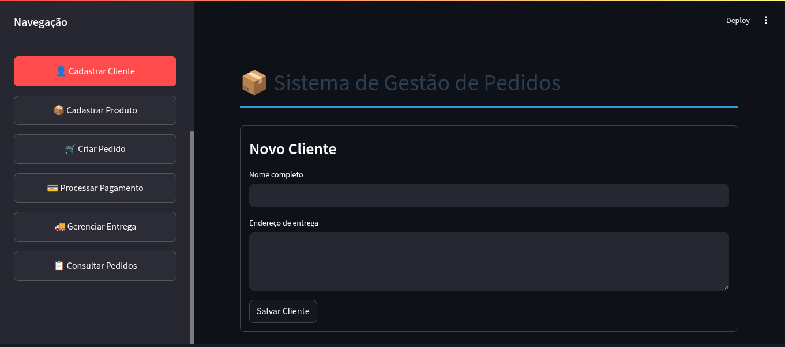
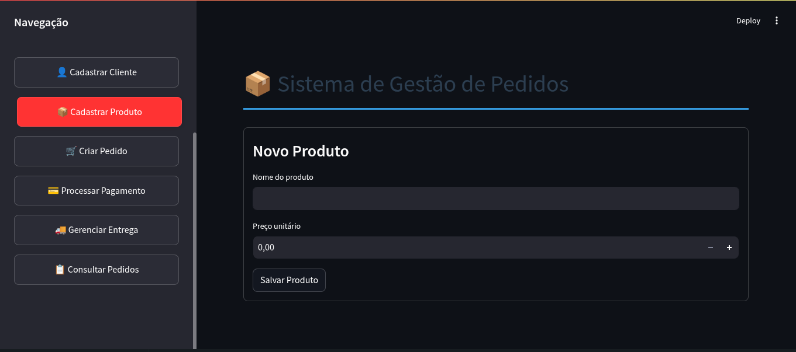
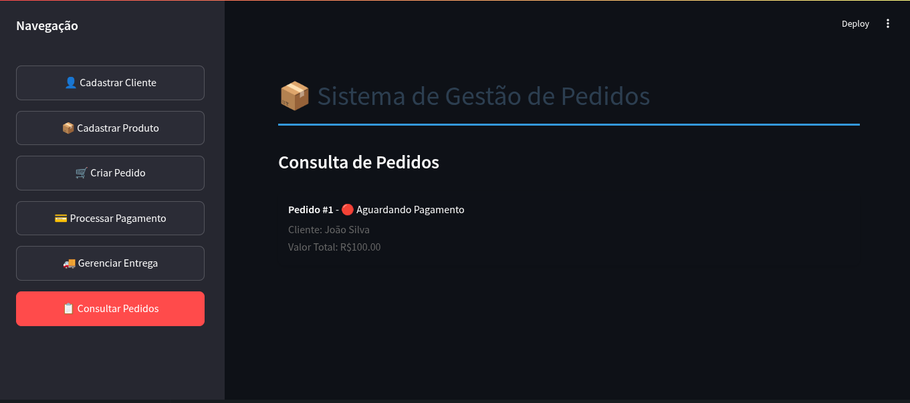
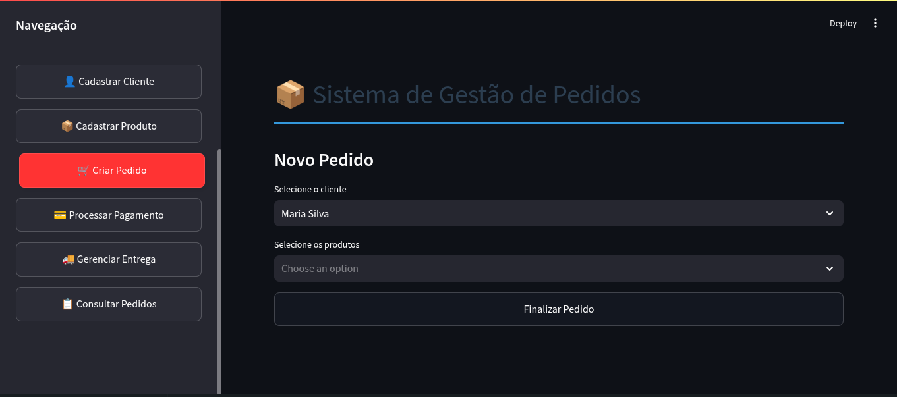
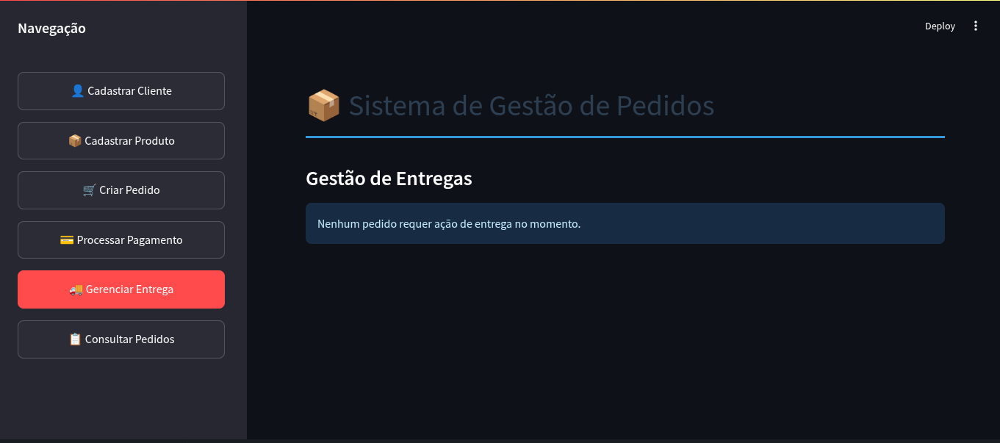
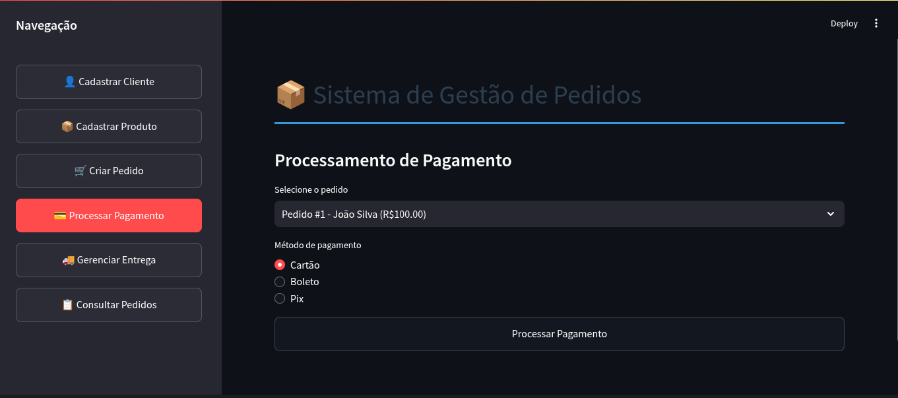
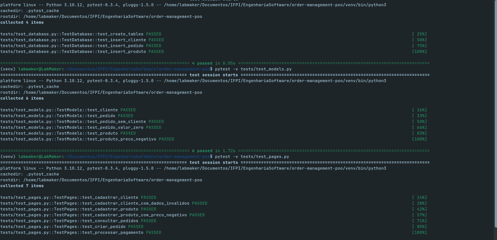

<!-- Improved compatibility of back to top link: See: https://github.com/othneildrew/Best-README-Template/pull/73 -->
<a name="top"></a>
<!--
*** Thanks for checking out the Best-README-Template. If you have a suggestion
*** that would make this better, please fork the repo and create a pull request
*** or simply open an issue with the tag "enhancement".
*** Don't forget to give the project a star!
*** Thanks again! Now go create something AMAZING! :D
-->


<!-- PROJECT SHIELDS -->
<!--
*** I'm using markdown "reference style" links for readability.
*** Reference links are enclosed in brackets [ ] instead of parentheses ( ).
*** See the bottom of this document for the declaration of the reference variables
*** for contributors-url, forks-url, etc. This is an optional, concise syntax you may use.
*** https://www.markdownguide.org/basic-syntax/#reference-style-links
-->
[![Contributors][contributors-shield]][contributors-url]
[![Forks][forks-shield]][forks-url]
[![Stargazers][stars-shield]][stars-url]
[![Issues][issues-shield]][issues-url]
[![MIT License][license-shield]][license-url]
[![LinkedIn][linkedin-shield]][linkedin-url]


<!-- PROJECT LOGO -->
<br/>
<h3 align="center">Order management POO</h3>

  <p align="center">
    <br/>
    <br />
    <a href="https://github.com/HeitorLouzeiroRepositoryIFPI/order-management-poo/issues">Report Bug</a>
    ·
    <a href="https://github.com/HeitorLouzeiroRepositoryIFPI/order-management-poo/issues">Request Feature</a>

  </p>
</div>


<!-- TABLE OF CONTENTS -->
<details>
  <summary>Table of Contents</summary>
  <ol>
    <li>
      <a href="#about-the-project">About The Project</a>
      <ul>
        <li><a href="#built-with">Built With</a></li>
      </ul>
    </li>
    <li><a href="#usage">Usage</a></li>
    <li>
      <a href="#getting-started">Getting Started</a>
      <ul>
        <li><a href="#prerequisites">Prerequisites</a></li>
        <li><a href="#installation">Installation</a></li>
      </ul>
    </li>
    <li><a href="#roadmap">Roadmap</a></li>
    <li><a href="#contributing">Contributing</a></li>
    <li><a href="#collaborators">Collaborators</a></li>
    <li><a href="#license">License</a></li>
    <li><a href="#contact">Contact</a></li>
    <li><a href="#acknowledgments">Acknowledgments</a></li>
  </ol>
</details>


<!-- ABOUT THE PROJECT -->
## About The Project

Students must develop an object-oriented system for order management
of an e-commerce and then create automated tests to validate your
operation. The objective is to ensure that the system logic is correct, using
unit testing, integration and error handling.
Both the system and the tests must be done preferably in Java or
Python, as long as it uses automated tests and good POO practices.

<p align="right">(<a href="#top">back to top</a>)</p>


### Built With

* [![Python][Python]][Python-url]
* [![SQLite][SQLite]][SQLite]
* [![Streamlit][Streamlit]][Streamlit-url]

<p align="right">(<a href="#top">back to top</a>)</p>

<!-- USAGE EXAMPLES -->
## Usage
  ### 1.Register Customer Page.
<p align="center">
    
    <br/>
</p>

  ### 2.Register Product Page. 
<p align="center">
    
    <br/>
</p>
    
  ### 3.Consult Order Page. 
<p align="center">
    
    <br/>
</p>

  ### 4.Create Order Page. 
<p align="center">
    
    <br/>
</p>

  ### 5.Manage Delivery Page. 
<p align="center">
    
    <br/>
</p>

  ### 6.Process Order Page. 
<p align="center">
    
    <br/>
</p>

  ### 7.Tests. 
<p align="center">
    

### Prerequisites

* [Python](https://www.python.org/)

<!-- GETTING STARTED -->
## Getting Started
### Installation

1. Clone the repo
   ```sh
   git clone https://github.com/HeitorLouzeiroRepositoryIFPI/order-management-poo.git
   ```
2. Access the project folder in terminal/cmd
   ```sh
   cd order-management-poo
   ```
3. Create a virtualenv with Python 3.9.0.
   ```sh
   python -m venv venv
   ```
4. Activate virtualenv.
    * Ubunto
    ```sh
    source venv/bin/activate
    ```

    * MacOs
    ```sh
    source venv/bin/activate
    ```

    * Windows 
    ```sh
     venv/scripts/activate
    ```

5. Install as dependencies.
    ```sh
     pip install -r requirements.txt
    ```

9. Run the application.
    ```sh
     streamlit run app.py
    ```  
        
10. Run the tests.
    ```sh
     pytest -v tests/test_database.py
    ```   
    ```sh
     pytest -v tests/test_models.py
    ```   
    ```sh
     pytest -v tests/test_pages.py
    ```   

<p align="right">(<a href="#top">back to top</a>)</p>


<!-- ROADMAP -->
## Roadmap

- [x] Register Customer Page.
- [x] Register Product Page.
- [x] Consult Order Page. 
- [x] Create Order Page. 
- [x] Manage Delivery Page. 
- [x] Process Order Page. 
- [x] Tests.


See the [open issues](https://github.com/HeitorLouzeiroRepositoryIFPI/order-management-poo/issues) for a full list of proposed features (and known issues).

<p align="right">(<a href="#top">back to top</a>)</p>

<!-- CONTRIBUTING -->
## Contributing

Contributions are what make the open source community such an amazing place to learn, inspire, and create. Any contributions you make are **greatly appreciated**.

If you have a suggestion that would make this better, please fork the repo and create a pull request. You can also simply open an issue with the tag "enhancement".
Don't forget to give the project a star! Thanks again!

1. Fork the Project
2. Create your Feature Branch (`git checkout -b feature/Improvements`)
3. Commit your Changes (`git commit -m 'Add my new Enhancements'`)
4. Push to the Branch (`git push origin feature/Improvements`)
5. Open a Pull Request

<p align="right">(<a href="#top">back to top</a>)</p>

## Collaborators

We thank the following people who contributed to this project:

<table>
  <tr>
    <td align="center">
      <a href="#">
        <br>
        <sub>
          <b>Heitor Louzeiro</b>
        </sub>
      </a>
    </td>
  </tr>
</table>

<p align="right">(<a href="#top">back to top</a>)</p>


<!-- LICENSE -->
## License

Distributed under the MIT License. See [LICENSE](LICENSE) for more information.

<p align="right">(<a href="#top">back to top</a>)</p>


<!-- CONTACT -->
## Contact

<div align='center'>  
  <a href="https://www.instagram.com/heitorlouzeiro/" target="_blank">
    
  </a> 
  <a href = "mailto:heitorlouzeirodev@gmail.com">
        
  </a>
  <a href="https://www.linkedin.com/in/heitor-louzeiro/" target="_blank">
    
  </a> 
</div>

Project Link: [https://github.com/HeitorLouzeiroRepositoryIFPI/order-management-poo](https://github.com/HeitorLouzeiroRepositoryIFPI/order-management-poo)

<p align="right">(<a href="#top">back to top</a>)</p>


<!-- MARKDOWN LINKS & IMAGES -->
<!-- https://www.markdownguide.org/basic-syntax/#reference-style-links -->
[contributors-shield]: https://img.shields.io/github/contributors/HeitorLouzeiroRepositoryIFPI/order-management-poo.svg?style=for-the-badge
[contributors-url]: https://github.com/HeitorLouzeiroRepositoryIFPI/order-management-poo/graphs/contributors
[forks-shield]: https://img.shields.io/github/forks/HeitorLouzeiroRepositoryIFPI/order-management-poo.svg?style=for-the-badge
[forks-url]: https://github.com/HeitorLouzeiroRepositoryIFPI/order-management-poo/network/members
[stars-shield]: https://img.shields.io/github/stars/HeitorLouzeiroRepositoryIFPI/order-management-poo.svg?style=for-the-badge
[stars-url]: https://github.com/HeitorLouzeiroRepositoryIFPI/order-management-poo/stargazers
[issues-shield]: https://img.shields.io/github/issues/HeitorLouzeiroRepositoryIFPI/order-management-poo.svg?style=for-the-badge
[issues-url]: https://github.com/HeitorLouzeiroRepositoryIFPI/order-management-poo/issues
[license-shield]: https://img.shields.io/github/license/HeitorLouzeiroRepositoryIFPI/order-management-poo.svg?style=for-the-badge
[license-url]: https://github.com/HeitorLouzeiroRepositoryIFPI/order-management-poo/blob/master/license
[linkedin-shield]: https://img.shields.io/badge/-LinkedIn-black.svg?style=for-the-badge&logo=linkedin&colorB=555
[linkedin-url]: https://linkedin.com/in/heitor-louzeiro

[Python]: https://img.shields.io/badge/Python-14354C?style=for-the-badge&logo=python&logoColor=white
[Python-url]: https://www.python.org/

[Django]: https://img.shields.io/badge/Django-092E20?style=for-the-badge&logo=django&logoColor=white
[Django]: https://img.shields.io/badge/Django-092E20?style=for-the-badge&logo=django&logoColor=white
[Django-url]: https://www.djangoproject.com/

[SQLite]: https://img.shields.io/badge/SQLite-07405E?style=for-the-badge&logo=sqlite&logoColor=white
[SQLite-url]: https://www.sqlite.org/index.html

[Streamlit]: https://img.shields.io/badge/-Streamlit-FF4B4B?style=flat&logo=streamlit&logoColor=white
[Streamlit-url]: https://streamlit.io/
